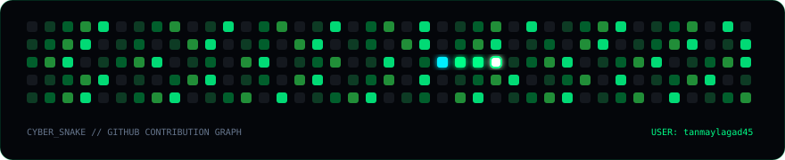

<div align="center">

# ⚡ TANMAY RAVIKIRAN LAGAD ⚡

<!-- Animated Typing Header -->
<a href="https://github.com/tanmaylagad45">
  
</a>

<p align="center">
  <b>MGM College of Engineering • Expected Graduation 2028 • Kharghar, Navi Mumbai, India</b>
</p>

<!-- Quick Social Badges -->
<p align="center">
  <a href="https://www.linkedin.com/in/tanmay-ravikiran-lagad">
    
  </a>
  <a href="https://github.com/tanmaylagad45">
    
  </a>
  <a href="https://www.instagram.com/tanmay_lagad_45/">
    
  </a>
</p>

---

</div>

## 👨‍💻 About Me

```yaml
identity:
  name: Tanmay Ravikiran Lagad
  status: 3rd Year B.Tech / BE Computer Engineering Student
  institution: MGM College of Engineering, Navi Mumbai
  expected_graduation: 2028
  location: Kharghar, Navi Mumbai, Maharashtra, India

core_focus:
  primary: Artificial Intelligence & Machine Learning (AI/ML)
  explorations: Generative AI, Full-Stack Architecture, Graph Relational Modeling
  motto: "Building my way into AI/ML through projects, experimentation and practical software development."
```

- 🎓 **Undergraduate**: 3rd Year Computer Engineering student at **MGM College of Engineering** (Graduation: 2028).
- 🏆 **Hackathon Podium Winner**: 🥉 **3rd Place — Internal Smart India Hackathon 2026** with project **NEXUS**.
- 💡 **Engineering Philosophy**: Learning by designing end-to-end practical software systems and experimenting with intelligent architectures.
- 📍 **Base**: Kharghar, Navi Mumbai, Maharashtra, India.

---

## 🛠️ Technology Stack & Constellation

<div align="center">

### Core Languages & Problem Solving


### AI, Machine Learning & Data Science


### Modern Web & Backend Frameworks


### Developer Tools & DevOps


</div>

> **Honesty Note**: These reflect technologies I am actively learning, exploring, and building projects with during my engineering curriculum.

---

## 🚀 Featured Projects

<table>
  <tr>
    <td width="50%" valign="top">
      <h3 align="center">🥉 NEXUS</h3>
      <p align="center"><b>AI-Powered Criminal Network Analysis System</b></p>
      <p align="center">
        
        
      </p>
      <p>
        An intelligent investigation platform designed to uncover hidden relationships between suspects, organizations, locations, and evidence. Transforms scattered multi-source investigation dossiers into a navigable hypergraph.
      </p>
      <ul>
        <li><b>My Role:</b> Database Architecture, Data Management, AI/ML Entity Association</li>
        <li><b>Tech:</b> Python, FastAPI, PostgreSQL, Graph Modeling, scikit-learn, React</li>
        <li><b>Achievement:</b> 🥉 <i>3rd Place — Internal Smart India Hackathon 2026 ("My first hackathon and first podium finish.")</i></li>
      </ul>
    </td>
    <td width="50%" valign="top">
      <h3 align="center">⚡ Velocity Sports Shop</h3>
      <p align="center"><b>Dynamic Sports Equipment E-Commerce Platform</b></p>
      <p align="center">
        
        
      </p>
      <p>
        A sports equipment e-commerce web application featuring real-time interactive cart calculations, quantity controls, responsive category sorting, and an intuitive checkout workflow.
      </p>
      <ul>
        <li><b>Features:</b> Dynamic Product Browsing, Shopping Cart System, Responsive Mobile UI</li>
        <li><b>Tech:</b> HTML5, CSS3, JavaScript</li>
      </ul>
    </td>
  </tr>
</table>

### 🔭 Upcoming AI/ML Horizons *(In Active Research & Prototyping)*
- 📄 **AI Resume Analyzer**: Semantic candidate evaluation using vector embeddings and LLM reasoning.
- 📈 **Machine Learning Prediction System**: End-to-end regression and classification metrics pipeline.
- 🧠 **RAG / AI Assistant**: Retrieval-augmented generation engine querying private technical repositories.

---

## 🏆 Achievements & Credentials

<div align="center">

```
FIRST HACKATHON ➔ 🥉 FIRST PODIUM (SIH 2026) ➔ NEXT GOAL: BUILDING MORE
```

</div>

- 🥉 **3rd Place Podium Winner** — *Internal Smart India Hackathon 2026* for Project NEXUS.
- 📜 **Google AI Essentials** — *Completed Certification Milestone* covering core AI fundamentals, Generative AI prompting, ethical AI, and practical workflow tools.
- 📘 **IBM Generative AI Engineer Professional Certificate** — *Learning / In Progress*.

---

## 📊 GitHub Universe & Live Telemetry

<div align="center">

<!-- GitHub Main Stats and Top Languages -->
<a href="https://github.com/tanmaylagad45">
  
  
</a>

<br/><br/>

<!-- GitHub Streak Stats -->
<a href="https://github.com/tanmaylagad45">
  
</a>

<br/><br/>

<!-- Contribution Activity Graph -->
<a href="https://github.com/tanmaylagad45">
  
</a>

</div>

---

## 🐍 GitHub Contribution Snake

<div align="center">

<!-- Dynamic Contribution Snake SVG generated via GitHub Actions workflow -->
<picture>
  <source media="(prefers-color-scheme: dark)" srcset="https://raw.githubusercontent.com/tanmaylagad45/Portfolio/output/github-snake-dark.svg">
  <source media="(prefers-color-scheme: light)" srcset="https://raw.githubusercontent.com/tanmaylagad45/Portfolio/output/github-snake.svg">
  
</picture>

<p align="center">
  <i>⚡ Powered by GitHub Actions cron job <code>.github/workflows/snake.yml</code> • Automated daily update for <b>@tanmaylagad45</b></i>
</p>

</div>

---

## 🎓 Academic Chronology

| Horizon | Institution | Milestone / Focus | Status |
|:---:|:---|:---|:---:|
| **2022** | Convent of Jesus and Mary High School | Secondary School (10th) | Completed (2022) |
| **2024** | Sanjivni Junior College | Higher Secondary (12th) — Science Stream | Completed (2024) |
| **2024 — Present** | MGM College of Engineering | B.Tech / BE Computer Engineering | **3rd Year (Class of 2028)** |

---

## 🌐 Portfolio Website Architecture

This repository hosts Tanmay's custom **3D developer portfolio website**:

- **Framework**: React 19 + TypeScript + Vite
- **3D Engine**: Three.js (Interactive Digital Core & orbital satellite nodes)
- **Styling**: Tailwind CSS v4, Glassmorphism, Neon Cyber Grid
- **Audio Synthesizer**: Web Audio API sci-fi sound fx
- **Configuration**: All personal data centralized in [`src/data/portfolioData.ts`](./src/data/portfolioData.ts)

### Running Locally
```bash
# Clone the repository
git clone https://github.com/tanmaylagad45/Portfolio.git

# Enter project directory
cd Portfolio

# Install dependencies
npm install

# Start Vite local development server
npm run dev

# Build production bundle
npm run build
```

---

## 📬 Contact & Telemetry Uplinks

<div align="center">

```bash
TANMAY@PORTFOLIO:~$ ./connect.sh --channel=all
> INITIALIZING SECURE UPLINK...
> KHARGHAR, NAVI MUMBAI, MAHARASHTRA, INDIA [UTC+5:30]
> STATUS: READY FOR COLLABORATION & INTERNSHIP OPPORTUNITIES
```

<p align="center">
  <a href="https://www.linkedin.com/in/tanmay-ravikiran-lagad">
    
  </a>
  &nbsp;
  <a href="https://github.com/tanmaylagad45">
    
  </a>
  &nbsp;
  <a href="https://www.instagram.com/tanmay_lagad_45/">
    
  </a>
</p>

---

<p align="center">
  <i>"Building today. Learning tomorrow. Creating the future."</i>
  <br/><br/>
  <b>Made with ❤️ by Tanmay Ravikiran Lagad</b>
  <br/>
  Kharghar, Navi Mumbai, Maharashtra, India
</p>

</div>
